# AutoEncoderによる線画の自動着色

## 概要
GANをベースにしたpix2pixの着色モデルが一般的だが   
AutoEncoderと単純な誤差の損失関数でどこまでいけるか確認してみたかった   


## ニューラルネットワーク
```
_________________________________________________________________
Layer (type)                 Output Shape              Param #   
=================================================================
conv2d_1 (Conv2D)            (None, 128, 128, 128)     512       
_________________________________________________________________
batch_normalization_1 (Batch (None, 128, 128, 128)     512       
_________________________________________________________________
activation_1 (Activation)    (None, 128, 128, 128)     0         
_________________________________________________________________
conv2d_2 (Conv2D)            (None, 128, 128, 256)     295168    
_________________________________________________________________
batch_normalization_2 (Batch (None, 128, 128, 256)     1024      
_________________________________________________________________
leaky_re_lu_1 (LeakyReLU)    (None, 128, 128, 256)     0         
_________________________________________________________________
max_pooling2d_1 (MaxPooling2 (None, 64, 64, 256)       0         
_________________________________________________________________
conv2d_3 (Conv2D)            (None, 64, 64, 512)       1180160   
_________________________________________________________________
batch_normalization_3 (Batch (None, 64, 64, 512)       2048      
_________________________________________________________________
leaky_re_lu_2 (LeakyReLU)    (None, 64, 64, 512)       0         
_________________________________________________________________
max_pooling2d_2 (MaxPooling2 (None, 32, 32, 512)       0         
_________________________________________________________________
conv2d_4 (Conv2D)            (None, 32, 32, 512)       2359808   
_________________________________________________________________
activation_2 (Activation)    (None, 32, 32, 512)       0         
_________________________________________________________________
conv2d_5 (Conv2D)            (None, 32, 32, 512)       2359808   
_________________________________________________________________
activation_3 (Activation)    (None, 32, 32, 512)       0         
_________________________________________________________________
conv2d_6 (Conv2D)            (None, 32, 32, 512)       2359808   
_________________________________________________________________
activation_4 (Activation)    (None, 32, 32, 512)       0         
_________________________________________________________________
conv2d_transpose_1 (Conv2DTr (None, 32, 32, 512)       2359808   
_________________________________________________________________
activation_5 (Activation)    (None, 32, 32, 512)       0         
_________________________________________________________________
conv2d_transpose_2 (Conv2DTr (None, 32, 32, 256)       1179904   
_________________________________________________________________
batch_normalization_4 (Batch (None, 32, 32, 256)       1024      
_________________________________________________________________
activation_6 (Activation)    (None, 32, 32, 256)       0         
_________________________________________________________________
up_sampling2d_1 (UpSampling2 (None, 64, 64, 256)       0         
_________________________________________________________________
conv2d_transpose_3 (Conv2DTr (None, 64, 64, 256)       590080    
_________________________________________________________________
batch_normalization_5 (Batch (None, 64, 64, 256)       1024      
_________________________________________________________________
activation_7 (Activation)    (None, 64, 64, 256)       0         
_________________________________________________________________
up_sampling2d_2 (UpSampling2 (None, 128, 128, 256)     0         
_________________________________________________________________
conv2d_7 (Conv2D)            (None, 128, 128, 256)     590080    
_________________________________________________________________
activation_8 (Activation)    (None, 128, 128, 256)     0         
_________________________________________________________________
dropout_1 (Dropout)          (None, 128, 128, 256)     0         
_________________________________________________________________
conv2d_8 (Conv2D)            (None, 128, 128, 128)     295040    
_________________________________________________________________
activation_9 (Activation)    (None, 128, 128, 128)     0         
_________________________________________________________________
dropout_2 (Dropout)          (None, 128, 128, 128)     0         
_________________________________________________________________
conv2d_9 (Conv2D)            (None, 128, 128, 64)      73792     
_________________________________________________________________
activation_10 (Activation)   (None, 128, 128, 64)      0         
_________________________________________________________________
dropout_3 (Dropout)          (None, 128, 128, 64)      0         
_________________________________________________________________
conv2d_10 (Conv2D)           (None, 128, 128, 3)       1731      
_________________________________________________________________
activation_11 (Activation)   (None, 128, 128, 3)       0         
=================================================================
```

## 推論結果

### 学習済みデータの推論結果　

| | |
| :--- | :--- |
| 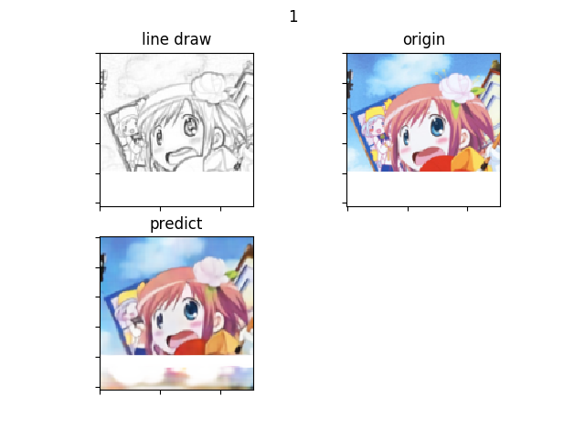 | 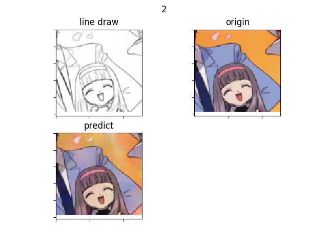 |
| 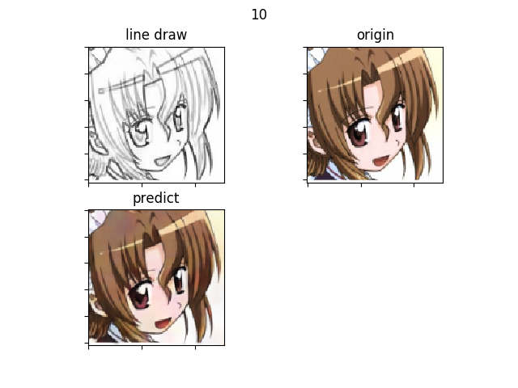 | 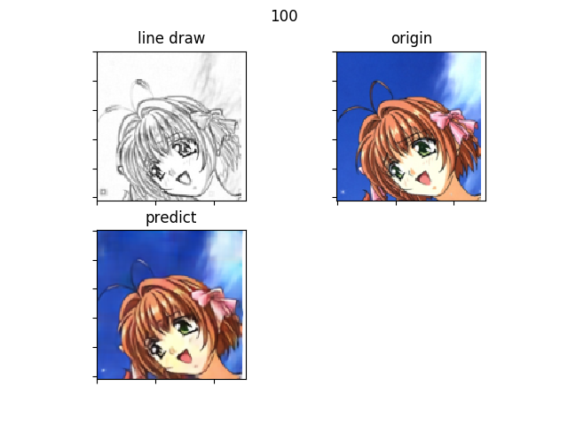 |
| 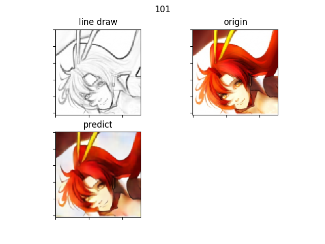 | 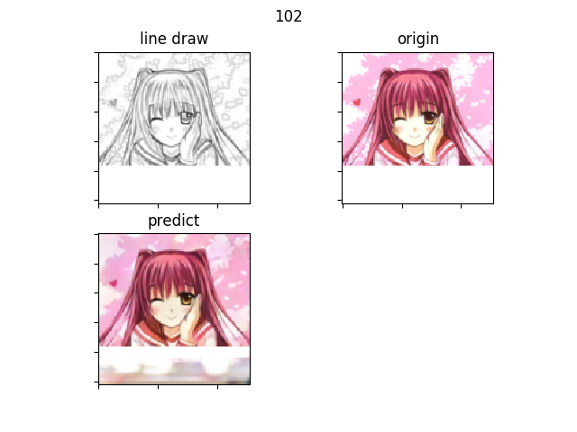 | 
| 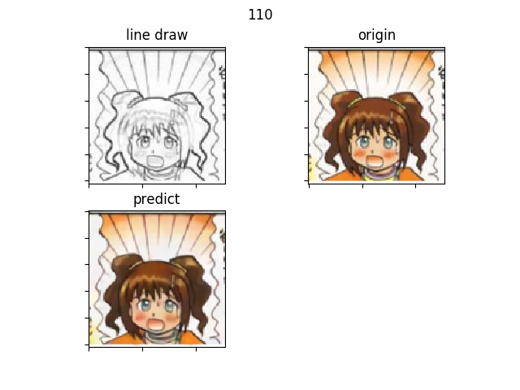 | 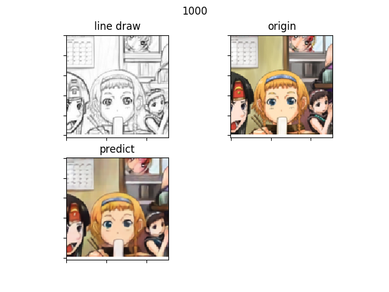 | 
| 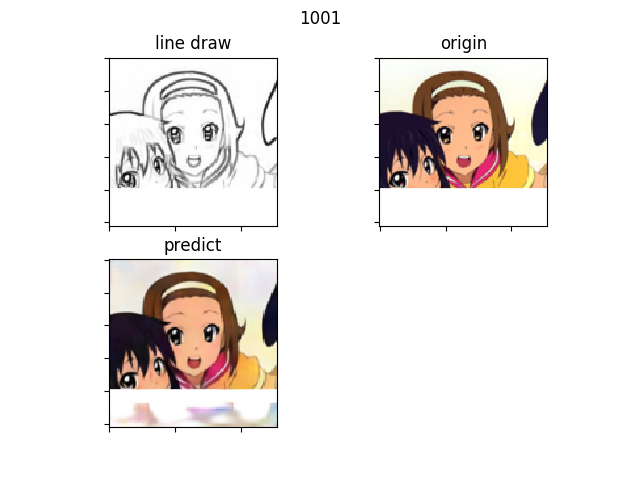 | 


### 未学習データの推論結果
#### type1
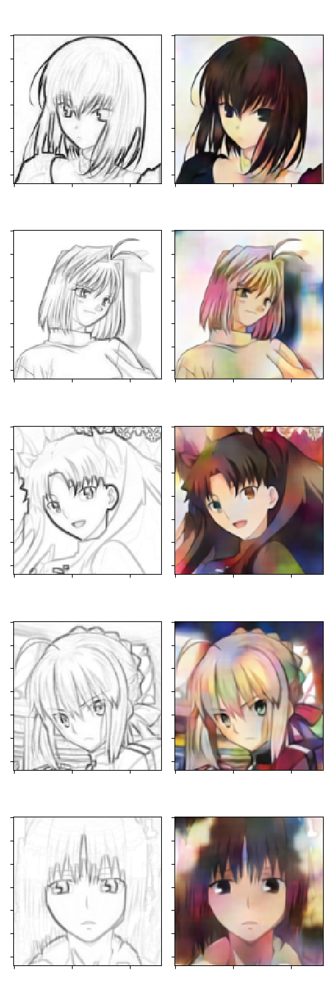

#### type2
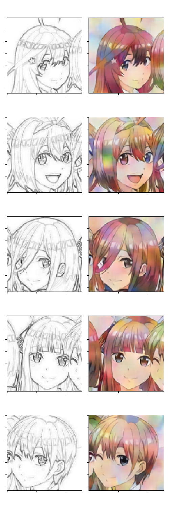

#### type3
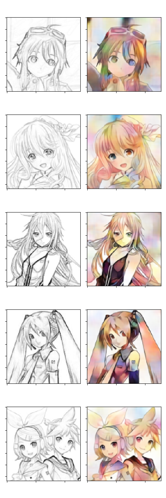

#### type4


## 補足
線画は配色済み画像から生成した。   
epochもネットワークレイヤーも積みすぎてしまっているのでもう少し賢くしたい。